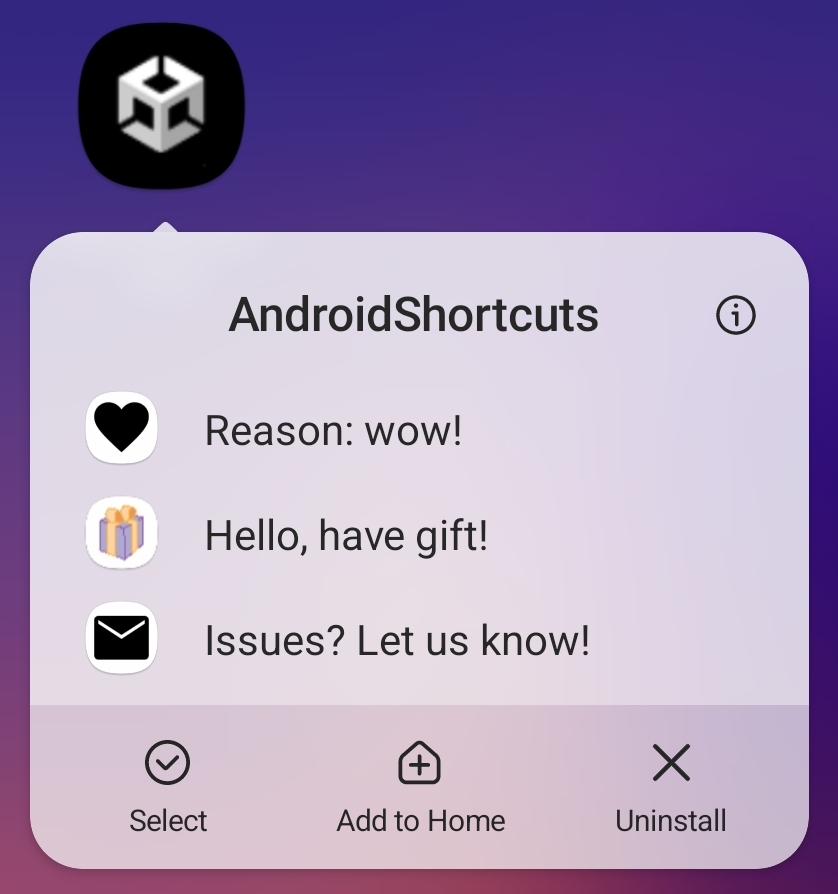

# Android Dynamic Shortcuts Plugin for Unity
A simple Unity android plugin that helps manage dynamic shortcuts.

### Installation
- Simply add the 'Shortcut' folder to your project or alternatively, install the .unitypackage
- Go to 'Project Settings > Player' and under 'Publishing Settings', enable 'Custom Main Gradle Template'
- Go to 'Plugins > Android > mainTemplate.gradle' and inside dependencies, add: 
    >implementation 'androidx.appcompat:appcompat:1.3.0'
- Or, if using EDM4U, it should automatically handle this dependency

### Current Features
- Manage shortcuts (add, remove, count, etc.) 
- Event based approach to handle cold start and background launch callback (opening the game through shortcut) 
- Pre-defined, pre-packaged ‘system’ icons to quickly add common shortcut icons 
- Ability to define custom icons
